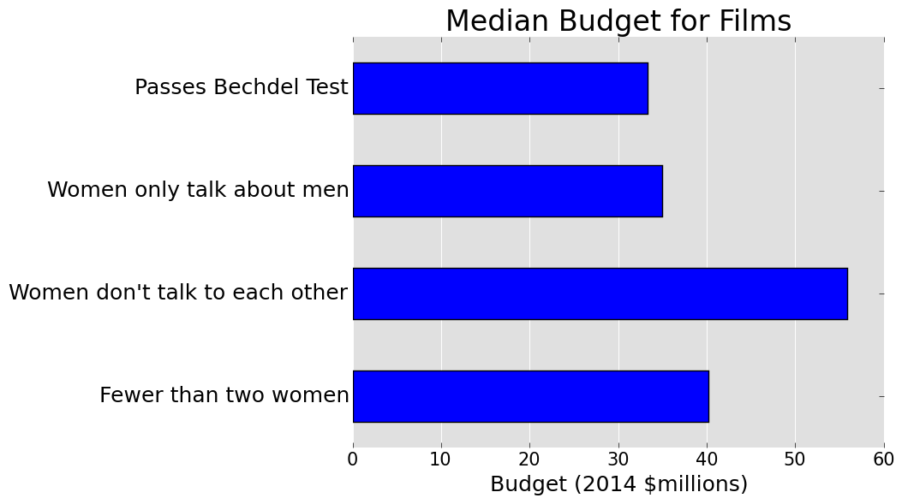
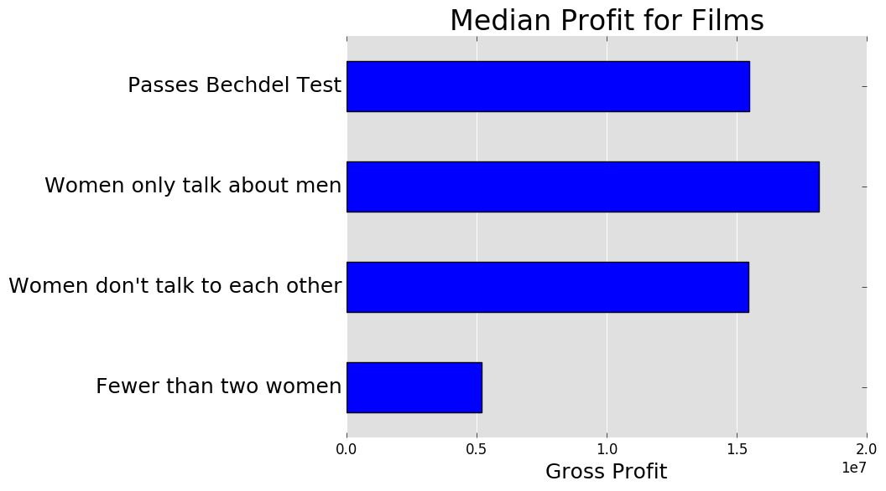

The Bechdel Test Article in FiveThirtyEight
===========================================

 

This example is an attempt to replicate the findings from [an article in FiveThirtyEight](http://fivethirtyeight.com/features/the-dollar-and-cents-case-against-hollywoods-exclusion-of-women/) that examines gender bias in the movie business using the Bechdel test: a movie passes the Bechdel test if there are (1) two named women in it, (2) who talk to each other, (3) about something besides a man. This example is based on an excellent [blog post](http://nbviewer.jupyter.org/github/brianckeegan/Bechdel/blob/master/Bechdel_test.ipynb) by Brian Keegan, who strongly advocates for reproducibility in data journalism. The code is available under the [MIT license](LICENSE).

Original Experiment
-------------------

The original experiment is composed by two steps:

1. [Data Collection](fetch.py): the datasets used by this example are collected from the Web. Four datasets are needed: [revenue data](revenue.csv) from movies, [inflation data](cpi.csv), [Bechdel test data](bechdel.json), and [data from IMDB](imdb_data.json).
2. [Data Analysis](bechdel.py): the datasets collected in the first step are joined and analysed, resulting in a number of different plots.

To run this experiment without ReproZip, you will first need to install the following [requirements](requirements.txt):

* [NumPy](http://www.numpy.org/)
* [pandas](http://pandas.pydata.org/)
* [Beautiful Soup 4](https://pypi.python.org/pypi/beautifulsoup4)
* [html5lib](https://github.com/html5lib/html5lib-python)
* [matplotlib](http://matplotlib.org/)
* [Requests](http://docs.python-requests.org/en/master/)
* [Statsmodels](http://statsmodels.sourceforge.net/index.html)

Then, run each script with Python, in the following order:

    $ python fetch.py    ## step 1
    $ python bechdel.py  ## step 2

Alternatively, you can run the data analysis step (step 2) directly using the data we provide in this repository.

ReproZip Package
----------------

The ReproZip package is available [here](https://osf.io/q7sdy/) (142 MB).

How to Reproduce
----------------

The steps of the experiment can be reproduced as follows:

    $ reprounzip vagrant setup bechdel-full.rpz bechdel/
    $ reprounzip vagrant run bechdel/ collectdata  ## step 1
    $ reprounzip vagrant run bechdel/ plotresults  ## step 2

Next, you can retrieve all the plots produced from the analysis as follows:

    $ reprounzip vagrant download bechdel/ --all

Packing From Our Demo VM
------------------------

If you are using our demo VM image, you can run the following:

    $ vagrant ssh
    $ workon bechedl-test
    $ cd reprozip-examples/bechdel-test/
    $ python bechdel.py
