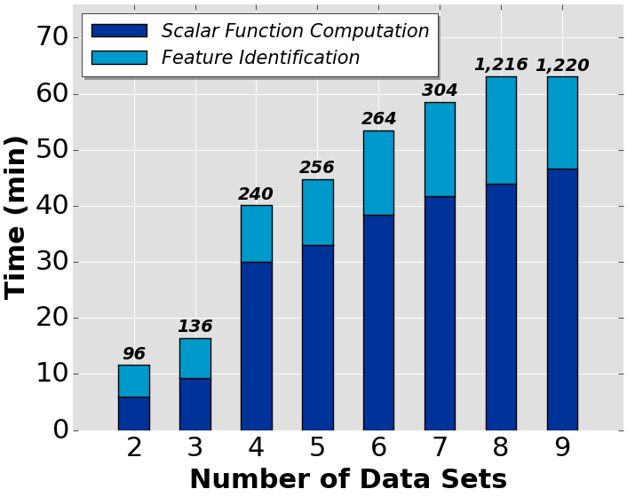
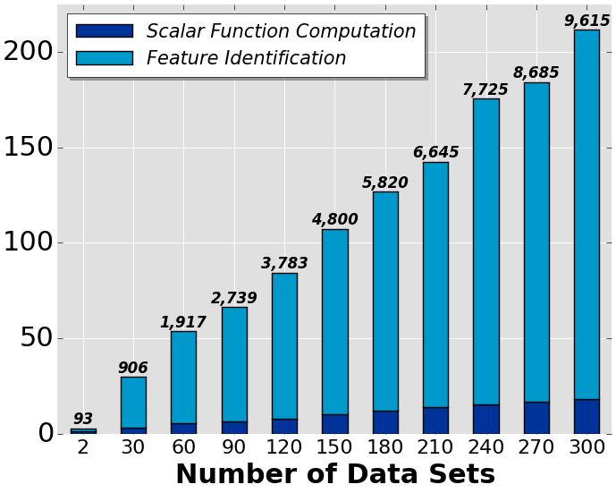

Data Polygamy
=============

 

[Data Polygamy](https://github.com/VIDA-NYU/data-polygamy) is a framework that allows users to query for statistically significant relationships between spatio-temporal datasets.

Implementation
--------------

Data Polygamy implementation and experiments are available [here](https://github.com/VIDA-NYU/data-polygamy). For more detailed information about the framework, take a look at the [SIGMOD 2016 paper](http://bigdata.poly.edu/~fchirigati/papers/chirigati-sigmod2016.pdf).

ReproZip Package
----------------

ReproZip packages for the plots of the [SIGMOD paper](http://bigdata.poly.edu/~fchirigati/papers/chirigati-sigmod2016.pdf) are available in sections [6.4](https://github.com/VIDA-NYU/data-polygamy#64-performance-evaluation) and [6.5](https://github.com/VIDA-NYU/data-polygamy#65-correctness-and-robustness) of Data Polygamy's repository.

How to Reproduce
----------------

Instructions on how to reproduce the plots are available [here](https://github.com/VIDA-NYU/data-polygamy#64-performance-evaluation) and [here](https://github.com/VIDA-NYU/data-polygamy#65-correctness-and-robustness).

For instance, to reproduce Figure 8:

    $ reprounzip vagrant setup figure-8.rpz figure-8/
    $ reprounzip vagrant run figure-8/ 8a
    $ reprounzip vagrant download figure-8/ output-nyc-urban.png:figure-8a.png
    $ reprounzip vagrant run figure-8/ 8b
    $ reprounzip vagrant download figure-8/ output-nyc-open.png:figure-8b.png

&nbsp;&nbsp;&nbsp;&nbsp;&nbsp;&nbsp;

 
