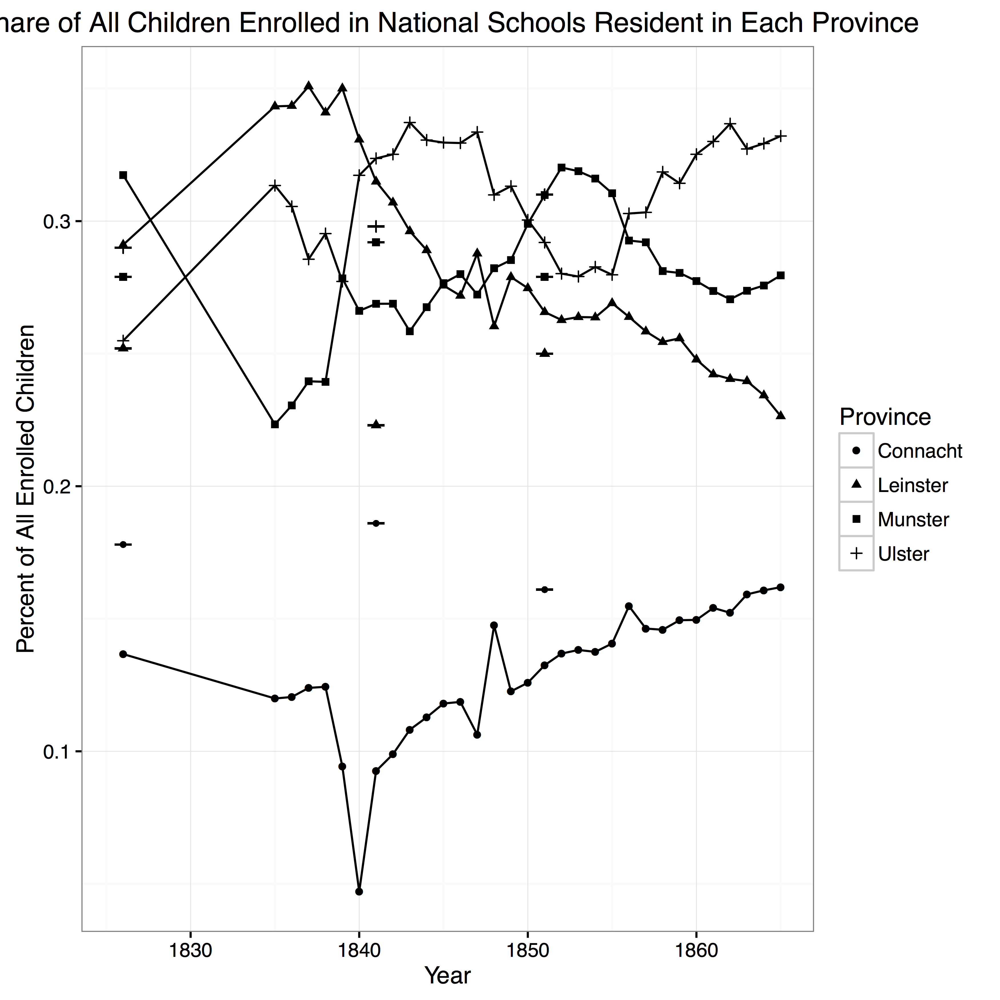

Irish National School System Plots 
==================================

&nbsp;&nbsp;&nbsp;&nbsp;&nbsp;&nbsp;

This example is an attempt to replicate the findings from [Nick Wolf](http://www.nmwolf.net/)'s [National School System and the Irish Language Heaney Lecture 2015](http://doi.org/10.17605/OSF.IO/PGK8V). The materials are from his lecture given as part of the Heaney Lecture Series at St. Patrick's College, Drumcondra, Ireland under the 2015 series theme of education. The lectures from this series will be published by Four Courts Press in 2016 in a collection edited by James Kelly of St. Patrick's College. Look for the published essay: "The National School System and the Irish Language in the Nineteenth Century" (ed. James Kelly, Four Courts Press, 2016).

From the project description: "One of the more puzzling aspects of the development of the Irish national education program in the nineteenth century was the ability of the commissioners to implement an English-only curriculum in a student population with a significant proportion of Irish speakers without experiencing pedagogical roadblocks, especially during its initial decades. This essay examines the distribution of schools in relation to Irish-speaking communities to assess the reasons for this response."

Original Experiment
-------------------
The original experiment uses this R script to create plots from the extracted Irish census data. If you were to look at the R script, you'd think that this is all you need to run the experiment again:

* [R](https://www.r-project.org/)
* [ggplot](http://ggplot2.org/)
* [RStudio (for those uncomfortable with the command line)](https://www.rstudio.com/products/rstudio/download/)

And then simply run: 

    $ RScript NationalSchools_Wolf_2016.R

However, if we look more closely at the [ReproZip package](https://osf.io/wfvqr/), we see many more dependencies:

    $ reprounzip info national-schools.rpz

There are: 
* *Total software packages*: 21
* *Packed software packages*: 21
* *Architecture*: x86_64 (current: amd64)
* *Distribution*: Ubuntu 14.04 (current: (not Linux))
*  *Inputs/outputs files (58)*: Counties_NatSchools_1851.csv, Lang_Schools_Counties.c
sv, Provinces_NatSchools.csv, Rcpp, Rcpp.rdb, Rcpp.rdx, Rcpp.so, Rdata.rdx, Rdat
a.rdx_2, Rdata.rdx_3, Rplots.pdf, arg, colorspace, colorspace.rdb, colorspace.rd
x, colorspace.so, digest, digest.rdb, digest.rdx, digest.so, ggplot2, ggplot2.rd
b, ggplot2.rdx, gtable, gtable.rdb, gtable.rdx, labeling, labeling.rdb, labeling
.rdx, munsell, munsell.rdx, nsInfo.rds, nsInfo.rds_2, nsInfo.rds_3, nsInfo.rds_4
, nsInfo.rds_5, nsInfo.rds_6, nsInfo.rds_7, nsInfo.rds_8, nsInfo.rds_9, package.
rds, package.rds_2, package.rds_3, package.rds_4, package.rds_5, package.rds_6,
package.rds_7, package.rds_8, package.rds_9, plyr, plyr.rdb, plyr.rdx, plyr.so,
scales, scales.rdb, scales.rdx, scales.so, sysdata.rdx

ReproZip Package
----------------

The ReproZip package is available [here](https://osf.io/wfvqr/).

Pack information:
* Compressed size: 16.43 MB
* Unpacked size: 36.18 MB
* Total packed paths: 320

How to Reproduce
----------------

The steps of the experiment can be reproduced as follows:

    $ reprounzip vagrant setup national-schools.rpz national-schools/ ## setup virtual machine
    $ reprounzip vagrant run national-schools/                        ## run the unpacker and reproduce the experiment

Next, you can retrieve all the plots in a single PDF produced from the analysis as follows:

    $ reprounzip vagrant download national-schools/ --all
