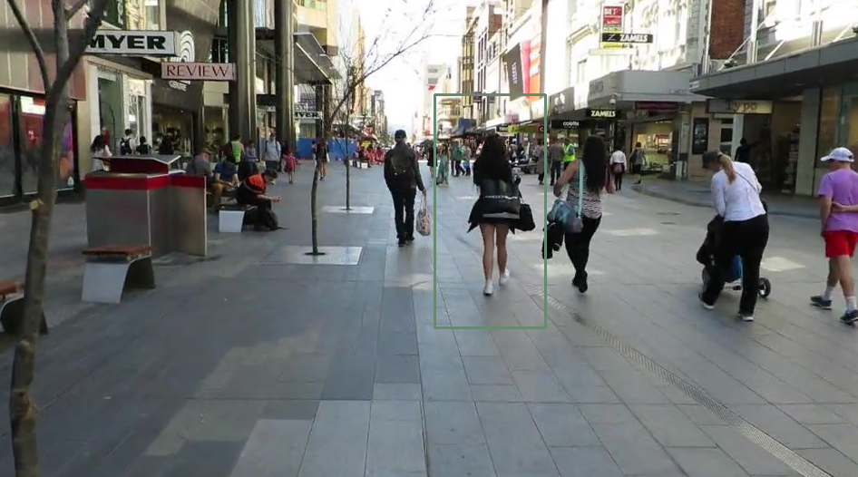

Multiple Object Tracking (MOT)
==============================

 

The main goal of this experiment is to track the movement of multiple objects from an input video.

Original Experiment
-------------------

The original experiment is available [here](https://github.com/BinalModi/Computer-Vision-Projects/tree/master/MultipleObjectTracking). Users first select an object in the input video, and then they press either the space or the enter key so that the program can automatically track the movement of this object as the video plays.

To run this experiment without ReproZip, you will first need to install [OpenCV 2.4.9.1](https://opencv.org/) and the following [requirements](requirements.txt):

* [opencv-contrib-python](https://pypi.org/project/opencv-contrib-python/)

Then, run the following script:

    $ python multipleObjectTracking.py

ReproZip Package
----------------

The ReproZip package is available [here](https://osf.io/jxhgu/) (52 MB).

How to Reproduce
----------------

You will need a local X server for display. For instance, if you are running on Mac OS X, you can use [XQuartz](https://www.xquartz.org/); if you are running on Windows, take a look at [Xming](https://sourceforge.net/projects/xming/). More information on packing and unpacking graphical applications can be found [here](http://reprozip.readthedocs.io/en/latest/faq.html#can-reprozip-pack-graphical-tools).

You can then run the experiment as following:

    $ reprounzip vagrant setup mot.rpz mot/
    $ reprounzip vagrant run --enable-x11 mot/

Packing From Our Demo VM
------------------------

If you are using our demo VM image, first, make sure you uncomment the ``v.gui = true`` line in the [Vagrantfile](../Vagrantfile) before running ``vagrant up``. Log in to the machine (username: ``vagrant``, password: ``vagrant``) and run the following:

    $ startxfce4

Then, open the Terminal and run:

    $ vagrant ssh
    $ workon mot
    $ cd reprozip-examples/mot/
    $ python multipleObjectTracking.py
